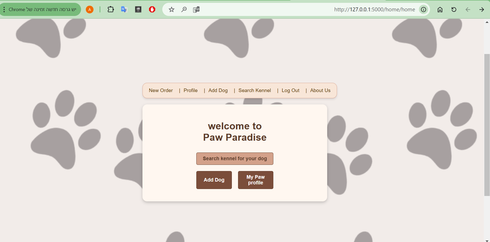

Paw Paradise Web Application

Project Overview

The Paw Paradise web application provides an easy and user-friendly platform for dog owners to find a kennel for their pets, manage their bookings, and track their stay. Users can register, book a stay for their dogs, add dogs to their profile, search for kennels, and manage their profiles conveniently.

User Guide

1. Home Page

Navigate to the home page to explore general details about the service.

Users can access the following options:

Search for a Kennel: Find available kennels for their dog.

Add a Dog: Register a new dog under their profile.

My Paw Profile: View and manage personal details and bookings.
2. Signing Up

Click on the Sign Up button to register as a new user.

Fill in the registration form with personal details.

Submit the form to create a new account.

3. Logging In

Click the Log In button to access your account.

Enter your credentials (email and password).

Click Sign In to log in successfully.

4. Adding a Dog

Navigate to My Paw Profile.

Click on Add a Dog and provide details.

Save the details, and the dog will be added to your profile.

5. Booking a Kennel

Once logged in, navigate to the Make an Order page.

Select a kennel, provide stay details, and confirm the booking.

The order will be saved and visible in the Profile Page.

6. Searching for Kennels

Navigate to the Search Kennels page.

Use filters to find the best kennel for your dog.

View kennel details and availability.

7. Viewing and Managing Profile

Navigate to My Paw Profile to:

View personal details.

Update account information.

See past and upcoming kennel bookings.

Cancel an order if necessary.

8. Viewing Top Kennels

Navigate to the Top Kennels page.

View the highest-rated kennels based on user feedback.

9. Viewing About Us

Navigate to the About Us page.

Learn about the purpose of Paw Paradise and its creators.

10. Logging Out

Click the Logout button to sign out and return to the home page.

Website Features

🏠 Home Page

Users can navigate to different sections of the site.

Screenshot:

📋 Sign Up Page

New users can create an account.

Screenshot:

🔑 Login Page

Screenshot:

🐶 Add a Dog Page

Users can register their dogs.

Screenshot:

📌 Make an Order Page

Users can book a kennel for their dogs.

Screenshot:

🔍 Search Kennels Page

Users can search for available kennels.

Screenshot:

🐾 My Paw Profile Page

Users can manage their account, dogs, and orders.

Screenshot:

ℹ️ About Us Page

Users can learn about the purpose of Paw Paradise and its creators.

Screenshot:

🚪 Logout Feature

Users can log out securely.

Screenshot:

Installation & Requirements

To run the project, make sure the following libraries are installed.
Add these dependencies to the requirements.txt file:

Flask
pymongo
Flask-Session
Werkzeug
Jinja2

To install all dependencies, run:

pip install -r requirements.txt

Additional Notes

Ensure that the MongoDB database is running before launching the project.

All pages are protected, meaning users must log in to access their profile and make orders.

